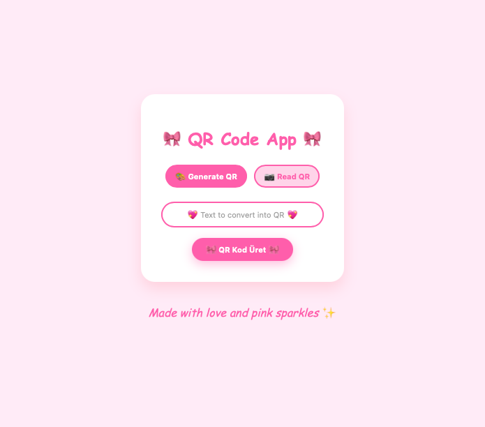
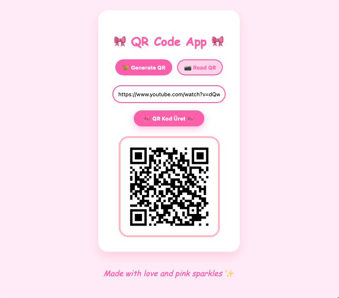
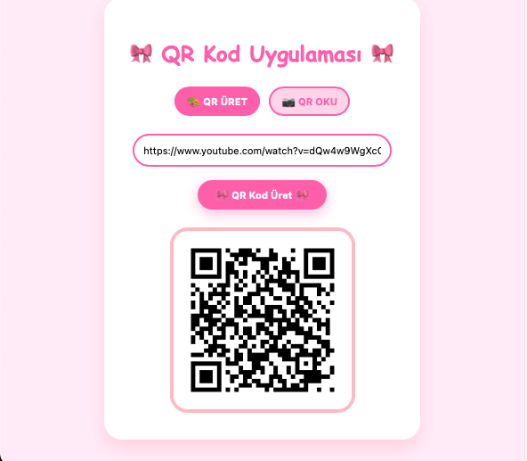

# 🎀 QR Kod Uygulaması 🎀





Pembe & kawaii temalı basit bir QR kod üretme ve okuma web uygulaması.  
Frontend React + saf CSS, backend FastAPI kullanılarak geliştirildi. 🎀✨

---

## 🚀 Kurulum

### 1️⃣ Backend (Python + FastAPI)

```bash
cd backend
pip install -r requirements.txt
uvicorn main:app --reload
````

👉 API şu adreste çalışır: [http://127.0.0.1:8000](http://127.0.0.1:8000)

---

### 2️⃣ Frontend (React)

```bash
cd frontend
npm install
npm run dev
```

👉 Uygulama şu adreste açılır: [http://localhost:5173](http://localhost:5173)

---

## 🎨 Özellikler

* 🎀 QR kod üretme (metni QR koda dönüştürür)
* 📷 QR kod okuma (yüklenen görselden QR kod içeriğini çözer)
* ✨ QR okutunca pembe yıldız animasyonu
* 📱 Responsive (mobil uyumlu)
* 💖 Tamamen pembe, kawaii, fairycore stilinde

---

## 📸 Ekran Görüntüsü

> Buraya projeden alacağın pembe tatlı ekran görüntülerini ekleyebilirsin. 🎀

---

## ✨ Made with love and pink sparkles ✨

```
